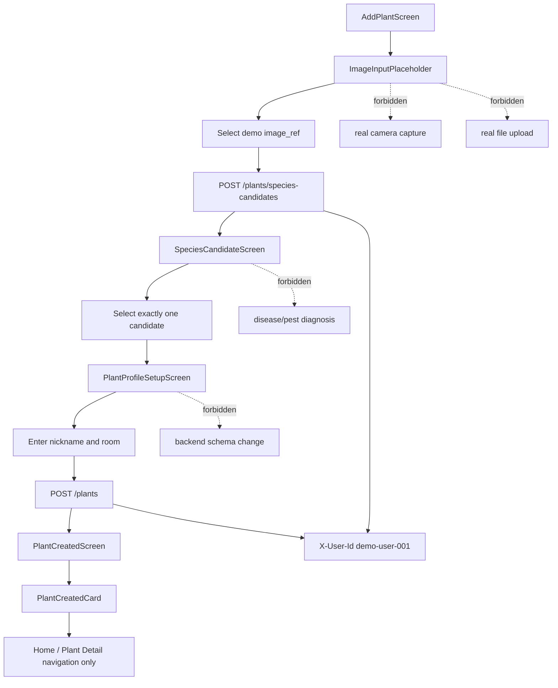

# TICKET-028 — Frontend Onboarding Flow

## 0. 목표

Sunshine 프론트엔드에서 식물 등록 온보딩 흐름을 구현한다.

이 티켓은 **프론트엔드 온보딩 UI만** 담당한다.
이 티켓은 backend API, DB schema, Docker/CI, real camera/upload, disease/pest diagnosis를 구현하지 않는다.

Ticket 28의 책임은 아래까지만이다.

```text
Add Plant screen
  -> demo image_ref 선택
  -> species candidates 요청
  -> candidate 선택
  -> nickname / room 입력
  -> plant 생성 요청
  -> Plant Created card 표시
```

---

## 1. Ticket Identity

```text
Ticket ID: TICKET-028
Name: Frontend Onboarding Flow
Layer: Frontend User Flow 1 / Plant Registration UI
```

Depends on:

```text
Ticket 2: Plant Onboarding API
Ticket 3: Species Candidate Mock / VisionPort Boundary
Ticket 25: Auth/User Scope Minimal
Ticket 26: API Response Schemas + Frontend Contract
Ticket 27: UI Shell / Frontend MVP Baseline
```

Does not depend on:

```text
Ticket 29: Frontend Home + Plant Detail
Ticket 30: Frontend Care Log + Feedback
Ticket 31: Frontend Chat + Answer View
Ticket 32: Frontend Growth History
real camera integration
real disease/pest classifier
production mobile app
```

---

## 2. 주변 티켓과의 연결

Ticket 28은 Ticket 27의 frontend shell 위에 onboarding flow를 채운다.

```text
Ticket 27:
  frontend shell, routes, API client baseline

Ticket 28:
  onboarding UI flow implementation

Ticket 29:
  Home + Plant Detail frontend

Ticket 30:
  Care Log frontend

Ticket 31:
  Chat frontend

Ticket 32:
  Growth History frontend
```

Ticket 28이 사용하는 backend contract:

```text
POST /plants/species-candidates
POST /plants
X-User-Id: demo-user-001
Ticket 26 response schemas
```

금지:

```text
backend endpoint 변경
real camera capture
real file upload
image storage
disease/pest/health diagnosis UI
later frontend screen implementation
```

---

## 3. 수정/생성 허용 파일

### 생성/수정 가능

```text
frontend/src/screens/AddPlantScreen.tsx
frontend/src/screens/SpeciesCandidateScreen.tsx
frontend/src/screens/PlantProfileSetupScreen.tsx
frontend/src/screens/PlantCreatedScreen.tsx
frontend/src/api/client.ts
frontend/src/api/types.ts
frontend/src/api/onboarding.ts
frontend/src/components/onboarding/ImageInputPlaceholder.tsx
frontend/src/components/onboarding/SpeciesCandidateList.tsx
frontend/src/components/onboarding/PlantProfileForm.tsx
frontend/src/components/onboarding/PlantCreatedCard.tsx
frontend/src/state/onboardingState.ts
frontend/src/__tests__/onboarding_flow.test.tsx
frontend/src/__tests__/onboarding_api.test.ts
docs/frontend_onboarding_flow.md
```

Optional component tests:

```text
frontend/src/components/onboarding/__tests__/ImageInputPlaceholder.test.tsx
frontend/src/components/onboarding/__tests__/SpeciesCandidateList.test.tsx
frontend/src/components/onboarding/__tests__/PlantProfileForm.test.tsx
frontend/src/components/onboarding/__tests__/PlantCreatedCard.test.tsx
```

### 좁은 수정 허용

```text
frontend/src/routes.tsx
frontend/src/App.tsx
frontend/src/components/Nav.tsx
```

허용 목적:

```text
onboarding route 연결
onboarding navigation label 추가
Ticket 27 shell route 보존
```

---

## 4. 금지 파일/디렉터리

아래는 생성하거나 수정하지 않는다.

```text
app/
alembic/
migrations/
Dockerfile
docker-compose.yml
.env.example
.github/workflows/
mobile/
ios/
android/
frontend/src/screens/HomeScreen.tsx
frontend/src/screens/PlantDetailScreen.tsx
frontend/src/screens/EnvironmentDetailScreen.tsx
frontend/src/screens/CareLogScreen.tsx
frontend/src/screens/ChatScreen.tsx
frontend/src/screens/GrowthHistoryScreen.tsx
frontend/src/screens/CompanionRecommendationScreen.tsx
playwright.config.*
cypress.config.*
selenium.*
```

이유:

```text
Ticket 28은 frontend onboarding flow만 구현한다.
backend, Docker/CI, mobile native, browser E2E, later frontend screens는 범위 밖이다.
```

---

## 5. UI Flow 계약

필수 route sequence:

```text
/plants/add
  -> AddPlantScreen

/plants/species-candidates
  -> SpeciesCandidateScreen

/plants/profile-setup
  -> PlantProfileSetupScreen

/plants/created
  -> PlantCreatedScreen
```

필수 전이:

```text
AddPlantScreen
  -> demo image_ref 선택
  -> species candidate API 호출
  -> SpeciesCandidateScreen 이동

SpeciesCandidateScreen
  -> candidate list 표시
  -> 정확히 하나의 species 선택
  -> PlantProfileSetupScreen 이동

PlantProfileSetupScreen
  -> nickname 입력
  -> room 입력
  -> create plant API 호출
  -> PlantCreatedScreen 이동

PlantCreatedScreen
  -> created plant card 표시
  -> Home / Plant Detail 이동 버튼 표시
  -> Home / Plant Detail 구현 자체는 Ticket 29로 넘김
```

---

## 6. Image Placeholder 계약

Ticket 28은 실제 camera/upload가 아니라 placeholder만 구현한다.

필수 UI label:

```text
사진 선택 placeholder
카메라로 찍기 placeholder
데모 이미지 사용
```

허용:

```text
deterministic image_ref 사용
예: image-demo-monstera-001
frontend state에 image_ref 저장
image_ref로 species candidate API 호출
```

금지:

```text
navigator.mediaDevices
getUserMedia
real camera capture
FormData file upload
object storage upload
image compression
EXIF processing
disease/pest image analysis
health classifier UI
```

---

## 7. Species Candidate UI 계약

필수 표시 field:

```text
species_id
common_name_ko
common_name_en
confidence_label 또는 confidence_score
```

필수 동작:

```text
candidate list render
하나만 선택 가능
선택 전 confirm/next disabled
fallback “잘 모르겠어요” 상태 표시
```

금지 visible label:

```text
병 진단
병충해 진단
해충 판정
건강 상태 판정
치료법
농약
약제
```

---

## 8. Plant Profile Setup 계약

필수 form field:

```text
nickname
room
```

필수 validation:

```text
nickname required
room required
selected species required
image_ref required
```

Create plant payload:

```json
{
  "species_id": "species-monstera",
  "nickname": "초록이",
  "room": "거실",
  "image_ref": "image-demo-monstera-001"
}
```

요청 header:

```http
X-User-Id: demo-user-001
```

---

## 9. Plant Created UI 계약

필수 표시 내용:

```text
created plant nickname
confirmed species name
room
character mood/expression if returned
status message if returned
Home 이동 버튼
Plant Detail 이동 버튼
```

규칙:

```text
PlantCreatedScreen은 Ticket 26의 PlantCreatedResponse 또는 호환 schema로 plant card를 render해야 한다.
```

---

## 10. API Client 계약

추가/확장할 method:

```typescript
type SpeciesCandidateInput = {
  image_ref: string;
};

type CreatePlantInput = {
  species_id: string;
  nickname: string;
  room: string;
  image_ref: string;
};

class SunshineApiClient {
  getSpeciesCandidates(input: SpeciesCandidateInput): Promise<SpeciesCandidateResponse>;
  createPlant(input: CreatePlantInput): Promise<PlantCreatedResponse>;
}
```

필수:

```text
Ticket 27 API client config 사용
X-User-Id header 전송
loading state 표시
error response는 ErrorState로 표시
Ticket 26 response type과 호환
```

---

## 11. Runtime 계약

허용 runtime shape:

```text
frontend dev server
  -> browser
  -> existing backend POST /plants/species-candidates
  -> existing backend POST /plants
```

금지 runtime shape:

```text
frontend
  -> camera device stream
  -> object storage upload
  -> image diagnosis service
  -> pest/disease classifier
  -> new backend endpoint
  -> worker process
```

Ticket 28은 새 backend runtime process, Docker service, CI topology를 추가하지 않는다.

---

## 12. Environment 계약

허용 frontend env:

```env
VITE_SUNSHINE_API_BASE_URL=http://localhost:8000
VITE_SUNSHINE_DEMO_USER_ID=demo-user-001
```

금지 env:

```text
CAMERA_*
UPLOAD_*
S3_*
VISION_*
DISEASE_*
PEST_*
OPENAI_*
ANTHROPIC_*
VLLM_*
JWT_*
OAUTH_*
```

Backend `.env.example`은 수정하지 않는다.

---

## 13. `/healthz` / `/readyz` 계약

Ticket 28은 아래를 수정하지 않는다.

```http
GET /healthz
```

Ticket 28은 아래를 추가하거나 수정하지 않는다.

```http
GET /readyz
```

규칙:

```text
/healthz = backend process liveness only
/readyz = dependency readiness only
```

Frontend는 `/healthz`를 backend connectivity smoke 용도로만 호출할 수 있다.
DB/model/camera readiness로 해석하지 않는다.

---

## 14. Functional Gate

Antigravity가 구현 후 실행해야 할 최소 gate:

```bash
#!/usr/bin/env bash
set -euo pipefail

cd frontend
npm ci
npm run typecheck
npm test -- --run
npm run build
cd ..

docker build -t sunshine-backend:ticket28 .
docker rm -f sunshine-backend-ticket28 >/dev/null 2>&1 || true

docker run -d \
  --name sunshine-backend-ticket28 \
  -p 8000:8000 \
  -e APP_NAME=sunshine-backend \
  -e APP_ENV=local \
  sunshine-backend:ticket28

cleanup() {
  docker rm -f sunshine-backend-ticket28 >/dev/null 2>&1 || true
}
trap cleanup EXIT

for i in $(seq 1 30); do
  if curl -fsS http://localhost:8000/healthz >/tmp/healthz.ticket28.json; then
    break
  fi
  sleep 1
done

test -s /tmp/healthz.ticket28.json

python - <<'PY'
import json
from pathlib import Path

body = json.loads(Path('/tmp/healthz.ticket28.json').read_text())
assert body == {'status': 'ok', 'service': 'sunshine-backend'}, body
PY

curl -fsS \
  -X POST 'http://localhost:8000/plants/species-candidates' \
  -H 'Content-Type: application/json' \
  -H 'X-User-Id: demo-user-001' \
  -d '{"image_ref":"image-demo-monstera-001"}' \
  > /tmp/ticket28.species_candidates.json

python - <<'PY'
import json
from pathlib import Path

body = json.loads(Path('/tmp/ticket28.species_candidates.json').read_text())
assert 'candidates' in body
assert isinstance(body['candidates'], list)
text = json.dumps(body, ensure_ascii=False).lower()
for forbidden in ['disease', 'pest', '병 진단', '병충해', '치료', '농약']:
    assert forbidden not in text, forbidden
PY
```

---

## 15. Required Tests

최소 테스트:

```text
test_add_plant_screen_renders_image_placeholder
test_add_plant_screen_has_demo_image_button
test_add_plant_screen_has_take_photo_placeholder
test_add_plant_screen_calls_species_candidates_api
test_species_candidate_screen_renders_candidates
test_species_candidate_screen_requires_selection
test_species_candidate_screen_shows_unknown_fallback
test_species_candidate_screen_has_no_disease_or_pest_labels
test_profile_setup_requires_nickname
test_profile_setup_requires_room
test_profile_setup_requires_selected_species
test_profile_setup_calls_create_plant_api
test_plant_created_screen_renders_plant_card
test_plant_created_screen_shows_nickname_species_room
test_onboarding_flow_navigates_add_to_candidates_to_profile_to_created
test_onboarding_api_client_sends_x_user_id
test_no_real_camera_capture_code
test_no_file_upload_pipeline
test_healthz_contract_unchanged
test_no_readyz_added_by_ticket28
```

---

## 16. Acceptance Criteria

Ticket 28은 아래가 모두 참일 때만 완료다.

```text
Add Plant screen 구현
image upload/take-photo placeholder 존재
demo image_ref 선택 가능
species candidates API 호출
candidate list 표시
candidate 하나 선택 가능
species confirmation 가능
nickname 입력 가능
room 입력 가능
create plant API 호출
Plant Created screen 표시
created plant card에 nickname/species/room 표시
병/해충/건강 진단 UI 없음
real camera capture 없음
real file upload 없음
API client가 X-User-Id 전송
frontend tests pass
frontend build pass
backend /healthz unchanged
/readyz not introduced
Docker backend smoke pass
```

---

## 17. Mermaid Flow



---

## 18. Boundary Verdict

```text
Scope preserved: yes
Later frontend screen leakage: no
Backend code modification: no
Real camera capture: no
Real file upload: no
Disease/pest diagnosis UI: no
Docker/compose modification: no
/healthz modified: no
/readyz introduced: no
Ticket 28 independently verifiable: yes
```
