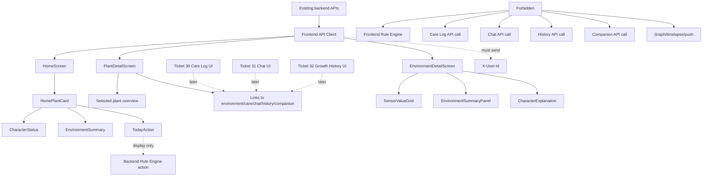

# TICKET-029 — Frontend Home + Plant Detail

## 0. 목표

Sunshine frontend에서 사용자가 오늘의 식물 상태와 환경 정보를 볼 수 있는 최소 화면을 구현한다.

이 티켓은 Home, Plant Detail, Environment Detail만 담당한다.  
이 티켓은 Care Log UI를 만들지 않는다.  
이 티켓은 Chat UI를 만들지 않는다.  
이 티켓은 Growth History UI를 만들지 않는다.  
이 티켓은 Companion Recommendation UI를 만들지 않는다.  
이 티켓은 frontend에서 care decision을 계산하지 않는다.

Ticket 29의 책임은 아래까지만이다.

```text
HomeScreen
  -> home plant card
  -> character mood/expression/status
  -> latest environment summary
  -> today action from backend

PlantDetailScreen
  -> selected plant overview
  -> navigation links to later flows

EnvironmentDetailScreen
  -> latest sensor values
  -> 24h summary
  -> 7d summary
  -> backend-provided explanation
```

---

## 1. Ticket Identity

### Ticket ID

```text
TICKET-029
```

### Name

```text
Frontend Home + Plant Detail
```

### Goal

```text
Implement Home, Plant Detail, and Environment Detail frontend views using existing backend response contracts.
```

### Core output

```text
Home screen
plant card component
daily character/status display
latest environment display
today action display
plant detail screen
environment detail screen
24h/7d summary panels
frontend API client methods for home/card/environment
frontend tests
```

### Strict non-goal

```text
no care log write UI
no watering action button
no chat input
no chat answer rendering
no pest reference display
no companion recommendation display
no growth history timeline
no sensor graph rendering
no timelapse
no push notification
no frontend rule engine
no frontend LLM call
no backend API change
no DB migration
no Docker/compose change
no browser E2E automation
```

---

## 2. 주변 티켓과의 연결

Ticket 29는 frontend shell 이후의 Home/Detail 화면 구현이다.

```text
Ticket 26:
  HomePlantCardResponse / EnvironmentDetailResponse schema 제공

Ticket 27:
  frontend shell, routes, shared API client baseline 제공

Ticket 28:
  onboarding flow 완료 후 Home/Plant Detail로 이동 가능

Ticket 29:
  Home + Plant Detail + Environment Detail 화면 구현

Ticket 30:
  Care Log + Feedback UI

Ticket 31:
  Chat + Answer View UI

Ticket 32:
  Growth History UI
```

Ticket 29의 역할:

```text
existing backend Home/Card/Environment APIs
  -> frontend API client
  -> HomeScreen / PlantDetailScreen / EnvironmentDetailScreen
  -> user-visible current condition and environment UI
```

금지:

```text
Care Log 구현
Chat 구현
Growth History 구현
Companion Recommendation 구현
frontend-side care decision 계산
backend route/service/schema 수정
```

---

## 3. 수정/생성 허용 파일

### 수정 가능한 frontend 파일

```text
frontend/src/screens/HomeScreen.tsx
frontend/src/screens/PlantDetailScreen.tsx
frontend/src/screens/EnvironmentDetailScreen.tsx
frontend/src/api/client.ts
frontend/src/api/types.ts
frontend/src/api/home.ts
frontend/src/api/environment.ts
frontend/src/state/selectedPlantState.ts
```

### 생성 가능한 component 파일

```text
frontend/src/components/home/HomePlantCard.tsx
frontend/src/components/home/CharacterStatus.tsx
frontend/src/components/home/EnvironmentSummary.tsx
frontend/src/components/home/TodayAction.tsx
frontend/src/components/environment/SensorValueGrid.tsx
frontend/src/components/environment/EnvironmentSummaryPanel.tsx
frontend/src/components/environment/CharacterExplanation.tsx
frontend/src/components/environment/EnvironmentWindowTabs.tsx
```

### 생성 가능한 test/docs 파일

```text
frontend/src/__tests__/home_detail_flow.test.tsx
frontend/src/__tests__/home_environment_api.test.ts
frontend/src/components/home/__tests__/HomePlantCard.test.tsx
frontend/src/components/home/__tests__/CharacterStatus.test.tsx
frontend/src/components/home/__tests__/EnvironmentSummary.test.tsx
frontend/src/components/home/__tests__/TodayAction.test.tsx
frontend/src/components/environment/__tests__/SensorValueGrid.test.tsx
frontend/src/components/environment/__tests__/EnvironmentSummaryPanel.test.tsx
frontend/src/components/environment/__tests__/CharacterExplanation.test.tsx
docs/frontend_home_detail_flow.md
```

### 조건부 수정 허용

```text
frontend/src/routes.tsx
frontend/src/App.tsx
frontend/src/components/Nav.tsx
```

조건:

```text
Home / Plant Detail / Environment Detail route wiring만 허용
Ticket 27 shell routes 보존
Ticket 28 onboarding routes 보존
later flow 화면 구현 금지
```

---

## 4. 금지 파일/디렉터리

아래 경로는 생성하거나 수정하지 않는다.

```text
app/
alembic/
migrations/
Dockerfile
docker-compose.yml
.env.example
.github/workflows/
mobile/
ios/
android/
playwright.config.*
cypress.config.*
selenium.*
```

아래 frontend 화면/컴포넌트는 수정하지 않는다.

```text
frontend/src/screens/CareLogScreen.tsx
frontend/src/screens/ChatScreen.tsx
frontend/src/screens/GrowthHistoryScreen.tsx
frontend/src/screens/CompanionRecommendationScreen.tsx
frontend/src/components/care/
frontend/src/components/chat/
frontend/src/components/history/
frontend/src/components/companion/
```

규칙:

```text
Ticket 29 must not implement Care Log, Chat, Growth History, or Companion Recommendation content.
PlantDetailScreen may link to those routes only.
```

---

## 5. 화면 계약

### HomeScreen

Route:

```text
/
```

필수 표시:

```text
오늘의 식물 상태
plant nickname
species name if provided
room if provided
character mood
character expression
character status message
latest environment summary
today's recommended action
link to plant detail
link to environment detail
```

빈 상태:

```text
No plant exists
  -> show empty state
  -> link to Add Plant
```

### PlantDetailScreen

Route:

```text
/plants/:plantId
```

필수 표시:

```text
식물 상세
selected plant nickname
character state summary
latest environment summary
today's recommended action
navigation links to:
  - environment detail
  - care log
  - chat
  - growth history
  - companion recommendation
```

중요:

```text
PlantDetailScreen may link to later screens.
It must not implement later screen content.
```

### EnvironmentDetailScreen

Route:

```text
/plants/:plantId/environment
```

필수 표시:

```text
환경 상세
latest temperature
latest humidity
latest light
latest soil moisture
24h summary
7d summary
character/environment explanation
loading state
error state
```

---

## 6. 컴포넌트 계약

### HomePlantCard

Required props shape:

```typescript
type HomePlantCardProps = {
  plantId: string;
  nickname: string;
  speciesName?: string;
  room?: string;
  character: CharacterStatusView;
  latestEnvironment: LatestEnvironmentView | null;
  todayAction: TodayActionView | null;
};
```

필수 동작:

```text
render nickname prominently
render species/room when available
render character mood/expression
render status message
render latest environment if available
render one backend-provided today action if available
render fallback when environment is missing
```

### CharacterStatus

표시:

```text
mood
expression
status_message
reason_code only if useful and not noisy
```

금지:

```text
LLM-generated mood claim
free-form personality text not returned by API
```

### EnvironmentSummary

표시:

```text
temperature_c
humidity_pct
light_lux
soil_moisture_pct
measured_at
```

### TodayAction

표시:

```text
action
severity
reason
```

불변식:

```text
TodayAction displays backend Rule Engine output.
Frontend must not compute watering/light/humidity/temperature decisions locally.
```

### Environment detail components

필수:

```text
SensorValueGrid:
  latest temperature / humidity / light / soil moisture

EnvironmentSummaryPanel:
  24h summary
  7d summary

CharacterExplanation:
  backend-provided explanation text
```

금지:

```text
frontend-generated care advice
frontend-side rule engine
charting library requirement
timelapse UI
```

---

## 7. API Client 계약

추가/유지할 API methods:

```typescript
getHome(): Promise<HomePlantCardResponse>;
getPlantCard(plantId: string): Promise<HomePlantCardResponse>;
getEnvironmentDetail(plantId: string): Promise<EnvironmentDetailResponse>;
```

필수 header:

```http
X-User-Id: demo-user-001
```

허용 endpoint:

```text
GET /home
GET /plants/{plant_id}/card
GET /plants/{plant_id}/environment
GET /healthz for smoke only
```

금지 endpoint call:

```text
POST /plants/{plant_id}/care-logs
POST /plants/{plant_id}/chat
GET /plants/{plant_id}/history
GET /plants/{plant_id}/companion-recommendations
```

주의:

```text
Ticket 29 may show navigation links to care/chat/history/companion screens.
Ticket 29 must not call those APIs.
```

---

## 8. Data Rendering 계약

필수 fallback:

```text
no plant exists:
  "아직 등록된 식물이 없어요." + Add Plant link

latest environment is null:
  "아직 센서 데이터가 없어요."

24h summary is null:
  "24시간 요약이 아직 없어요."

7d summary is null:
  "7일 요약이 아직 없어요."

today action is null:
  neutral state, no fabricated care advice
```

금지:

```text
inventing sensor values
inventing watering advice
inventing light advice
hardcoding "물을 주세요" without backend action
treating missing data as healthy/unhealthy
```

---

## 9. Runtime 계약

허용 runtime:

```text
frontend dev server
  -> browser
  -> existing backend Home/Card/Environment APIs
  -> render Ticket 26 response schemas
```

backend runtime은 변경하지 않는다.

```text
backend container
  -> uvicorn app.main:app
  -> /healthz
  -> existing MVP APIs
```

금지 runtime:

```text
frontend starts backend
frontend starts DB
frontend starts MQTT
frontend starts Redis
frontend starts vLLM
frontend starts chart rendering service
frontend starts browser E2E runner
```

Ticket 29는 추가하지 않는다.

```text
0 backend processes
0 workers
0 schedulers
0 browser automation daemons
0 chart rendering servers
0 telemetry collectors
0 model loaders
```

---

## 10. 환경 변수 계약

허용 frontend env:

```env
VITE_SUNSHINE_API_BASE_URL=http://localhost:8000
VITE_SUNSHINE_DEMO_USER_ID=demo-user-001
```

금지 env:

```text
CHART_*
ANALYTICS_*
PUSH_*
OPENAI_*
ANTHROPIC_*
VLLM_*
MQTT_*
REDIS_*
MARKETPLACE_*
```

규칙:

```text
Do not edit backend .env.example.
Do not introduce chart/analytics/push/LLM/marketplace configuration.
```

---

## 11. /healthz, /readyz 경계

Ticket 29는 아래를 수정하지 않는다.

```http
GET /healthz
```

Ticket 29는 아래를 추가하거나 수정하지 않는다.

```http
GET /readyz
```

규칙:

```text
Frontend may call /healthz only for backend connectivity smoke.
Frontend must not interpret /healthz as sensor, DB, MQTT, or model readiness.
/healthz remains backend process liveness only.
/readyz remains dependency readiness only.
```

---

## 12. Functional Gate

아래 gate는 Ticket 29가 Home/Plant Detail/Environment Detail만 구현했는지 검증한다.

```bash
#!/usr/bin/env bash
set -euo pipefail

# Gate 0 — scope boundary
git diff --name-only origin/main...HEAD | tee /tmp/ticket29_changed_files.txt || true

python - <<'PY'
from pathlib import Path

allowed = {
    "frontend/src/screens/HomeScreen.tsx",
    "frontend/src/screens/PlantDetailScreen.tsx",
    "frontend/src/screens/EnvironmentDetailScreen.tsx",
    "frontend/src/api/client.ts",
    "frontend/src/api/types.ts",
    "frontend/src/api/home.ts",
    "frontend/src/api/environment.ts",
    "frontend/src/components/home/HomePlantCard.tsx",
    "frontend/src/components/home/CharacterStatus.tsx",
    "frontend/src/components/home/EnvironmentSummary.tsx",
    "frontend/src/components/home/TodayAction.tsx",
    "frontend/src/components/environment/SensorValueGrid.tsx",
    "frontend/src/components/environment/EnvironmentSummaryPanel.tsx",
    "frontend/src/components/environment/CharacterExplanation.tsx",
    "frontend/src/components/environment/EnvironmentWindowTabs.tsx",
    "frontend/src/state/selectedPlantState.ts",
    "frontend/src/routes.tsx",
    "frontend/src/App.tsx",
    "frontend/src/components/Nav.tsx",
    "frontend/src/__tests__/home_detail_flow.test.tsx",
    "frontend/src/__tests__/home_environment_api.test.ts",
    "docs/frontend_home_detail_flow.md",
}

forbidden_prefixes = (
    "app/",
    "alembic/",
    "migrations/",
    ".github/workflows/",
    "mobile/",
    "ios/",
    "android/",
)

forbidden_exact = {
    "Dockerfile",
    "docker-compose.yml",
    ".env.example",
    "frontend/src/screens/CareLogScreen.tsx",
    "frontend/src/screens/ChatScreen.tsx",
    "frontend/src/screens/GrowthHistoryScreen.tsx",
    "frontend/src/screens/CompanionRecommendationScreen.tsx",
    "playwright.config.ts",
    "playwright.config.js",
    "cypress.config.ts",
    "cypress.config.js",
}

changed = [line.strip() for line in Path("/tmp/ticket29_changed_files.txt").read_text().splitlines() if line.strip()]
violations = []
for file in changed:
    if file in forbidden_exact:
        violations.append(("forbidden_exact_file", file))
    if file.startswith(forbidden_prefixes):
        violations.append(("forbidden_prefix", file))
    if (
        file not in allowed
        and not file.startswith("frontend/src/components/home/")
        and not file.startswith("frontend/src/components/environment/")
        and not file.startswith("frontend/src/components/home/__tests__/")
        and not file.startswith("frontend/src/components/environment/__tests__/")
    ):
        violations.append(("not_in_allowed_files", file))

if violations:
    for kind, file in violations:
        print(f"{kind}: {file}")
    raise SystemExit(1)

print("ticket29_scope_boundary: pass")
PY

# Gate 1 — frontend install / typecheck / tests / build
cd frontend
npm ci
npm run typecheck
npm test -- --run
npm run build
cd ..

# Gate 2 — required files exist
python - <<'PY'
from pathlib import Path

required = [
    "frontend/src/screens/HomeScreen.tsx",
    "frontend/src/screens/PlantDetailScreen.tsx",
    "frontend/src/screens/EnvironmentDetailScreen.tsx",
    "frontend/src/components/home/HomePlantCard.tsx",
    "frontend/src/components/home/CharacterStatus.tsx",
    "frontend/src/components/home/EnvironmentSummary.tsx",
    "frontend/src/components/home/TodayAction.tsx",
    "frontend/src/components/environment/SensorValueGrid.tsx",
    "frontend/src/components/environment/EnvironmentSummaryPanel.tsx",
    "frontend/src/components/environment/CharacterExplanation.tsx",
]

for file in required:
    assert Path(file).exists(), file

print("home_detail_required_files: pass")
PY

# Gate 3 — API client contract
python - <<'PY'
from pathlib import Path

texts = []
for file in [
    "frontend/src/api/client.ts",
    "frontend/src/api/home.ts",
    "frontend/src/api/environment.ts",
    "frontend/src/api/types.ts",
]:
    path = Path(file)
    if path.exists():
        texts.append(path.read_text())

combined = "\n".join(texts)
required = [
    "getHome",
    "getPlantCard",
    "getEnvironmentDetail",
    "/home",
    "/card",
    "/environment",
    "X-User-Id",
    "HomePlantCardResponse",
    "EnvironmentDetailResponse",
]
missing = [token for token in required if token not in combined]
assert not missing, missing

print("home_environment_api_contract: pass")
PY

# Gate 4 — no later-flow endpoint calls
python - <<'PY'
from pathlib import Path

targets = [
    Path("frontend/src/screens/HomeScreen.tsx"),
    Path("frontend/src/screens/PlantDetailScreen.tsx"),
    Path("frontend/src/screens/EnvironmentDetailScreen.tsx"),
    Path("frontend/src/api/client.ts"),
]
for optional in ["frontend/src/api/home.ts", "frontend/src/api/environment.ts"]:
    p = Path(optional)
    if p.exists():
        targets.append(p)

for path in targets:
    text = path.read_text(errors="ignore")
    forbidden = [
        "/care-logs",
        "/chat",
        "/history",
        "/companion-recommendations",
        "askChat(",
        "createCareLog(",
    ]
    hits = [token for token in forbidden if token in text]
    assert not hits, f"{path}: later flow API leakage: {hits}"

print("no_later_flow_api_calls: pass")
PY

# Gate 5 — no frontend rule engine / fabricated care advice
python - <<'PY'
from pathlib import Path

targets = [
    Path("frontend/src/screens/HomeScreen.tsx"),
    Path("frontend/src/screens/PlantDetailScreen.tsx"),
    Path("frontend/src/screens/EnvironmentDetailScreen.tsx"),
    *Path("frontend/src/components/home").rglob("*.tsx"),
    *Path("frontend/src/components/environment").rglob("*.tsx"),
]

for path in targets:
    text = path.read_text(errors="ignore")
    forbidden = [
        "soil_moisture_pct <",
        "soil_moisture_pct >",
        "humidity_pct <",
        "light_lux <",
        "물을 주세요",
        "햇빛이 부족합니다",
        "ruleEngine",
        "computeAction",
        "generateAdvice",
        "openai",
        "anthropic",
        "vllm",
        "timelapse",
        "chart.js",
        "recharts",
        "d3",
    ]
    hits = [token for token in forbidden if token in text]
    assert not hits, f"{path}: frontend rule/advice/chart leakage: {hits}"

print("no_frontend_rule_engine_or_advice: pass")
PY

# Gate 6 — routes
python - <<'PY'
from pathlib import Path
routes = Path("frontend/src/routes.tsx").read_text()
for route in ["/", "/plants/:plantId", "/plants/:plantId/environment"]:
    assert route in routes, route
print("home_detail_routes: pass")
PY

# Gate 7 — backend health regression
docker build -t sunshine-backend:ticket29 .
docker rm -f sunshine-backend-ticket29 >/dev/null 2>&1 || true
docker run -d \
  --name sunshine-backend-ticket29 \
  -p 8000:8000 \
  -e APP_NAME=sunshine-backend \
  -e APP_ENV=local \
  sunshine-backend:ticket29

cleanup() {
  docker rm -f sunshine-backend-ticket29 >/dev/null 2>&1 || true
}
trap cleanup EXIT

for i in $(seq 1 30); do
  if curl -fsS http://localhost:8000/healthz >/tmp/healthz.ticket29.json; then
    break
  fi
  sleep 1
done

test -s /tmp/healthz.ticket29.json

python - <<'PY'
import json
from pathlib import Path
body = json.loads(Path("/tmp/healthz.ticket29.json").read_text())
assert body == {"status": "ok", "service": "sunshine-backend"}, body
print("healthz_liveness_regression: pass")
PY

# Gate 8 — backend API smoke
curl -fsS \
  -H "X-User-Id: demo-user-001" \
  "http://localhost:8000/home" \
  > /tmp/ticket29.home.json

curl -fsS \
  -H "X-User-Id: demo-user-001" \
  "http://localhost:8000/plants/demo-plant-chorok-001/environment" \
  > /tmp/ticket29.environment.json

python - <<'PY'
import json
from pathlib import Path
home = json.loads(Path("/tmp/ticket29.home.json").read_text())
env = json.loads(Path("/tmp/ticket29.environment.json").read_text())
home_text = json.dumps(home, ensure_ascii=False)
env_text = json.dumps(env, ensure_ascii=False)
for token in ["nickname", "character", "latest_environment", "today_action"]:
    assert token in home_text, token
for token in ["latest", "summary_24h", "summary_7d", "explanation"]:
    assert token in env_text, token
print("home_environment_backend_smoke: pass")
PY

# Gate 9 — readiness boundary
if grep -R "readyz" frontend docs; then
  echo "forbidden_readyz_frontend"
  exit 1
fi
if grep -R "readyz" app tests >/dev/null 2>&1; then
  echo "forbidden_readyz_backend"
  exit 1
fi

echo "ticket29_all_gates: pass"
```

---

## 13. Required Tests

최소 테스트:

```text
test_home_screen_renders_home_plant_card
test_home_screen_renders_character_mood_and_expression
test_home_screen_renders_environment_summary
test_home_screen_renders_today_action
test_home_screen_empty_state_links_to_add_plant
test_plant_detail_screen_renders_selected_plant_summary
test_plant_detail_screen_links_to_environment_care_chat_history_companion
test_environment_detail_screen_renders_latest_sensor_values
test_environment_detail_screen_renders_24h_summary
test_environment_detail_screen_renders_7d_summary
test_environment_detail_screen_renders_character_explanation
test_environment_detail_missing_latest_shows_fallback
test_environment_detail_missing_24h_summary_shows_fallback
test_environment_detail_missing_7d_summary_shows_fallback
test_home_environment_api_client_sends_x_user_id
test_frontend_does_not_compute_care_decision_locally
test_no_care_log_chat_history_companion_endpoint_calls
test_healthz_contract_unchanged
test_no_readyz_added_by_ticket29
```

---

## 14. Acceptance Criteria

Ticket 29는 아래 조건을 모두 만족해야 한다.

```text
HomeScreen renders home plant card.
HomeScreen shows character mood/expression.
HomeScreen shows latest environment summary.
HomeScreen shows today’s recommended action.
PlantDetailScreen renders selected plant overview.
PlantDetailScreen links to environment/care/chat/history/companion routes.
EnvironmentDetailScreen shows latest temperature.
EnvironmentDetailScreen shows latest humidity.
EnvironmentDetailScreen shows latest light.
EnvironmentDetailScreen shows latest soil moisture.
EnvironmentDetailScreen shows 24h summary.
EnvironmentDetailScreen shows 7d summary.
EnvironmentDetailScreen shows character explanation.
Missing environment data is shown as fallback, not fabricated.
Frontend does not compute Rule Engine decisions locally.
Frontend does not call care/chat/history/companion APIs in this ticket.
API client sends X-User-Id.
Frontend build passes.
Frontend tests pass.
Backend /healthz remains liveness-only.
/readyz is not introduced or modified by this ticket.
Docker backend smoke passes.
```

---

## 15. Mermaid Flow



---

## 16. Boundary Audit

```text
Scope preserved: yes
Later-ticket leakage: no
Care Log frontend implemented: no
Chat frontend implemented: no
Growth History frontend implemented: no
Companion recommendation UI implemented: no
Frontend rule engine implemented: no
Graph/timelapse/push implemented: no
Backend product code modified: no
Docker/compose modified: no
/healthz modified: no
/readyz introduced: no
Ticket 29 independently verifiable: yes
```
