# Ticket 33 — Antigravity Execution Contract

## 0. Goal

Add the **MVP Product Guardrail Tests** in the same bounded style as Ticket 14-derived contracts.

This ticket should give Antigravity one narrow job:

```text
existing MVP product paths
  -> global regression guardrail tests
  -> negative forbidden-pattern tests
  -> evidence/fixed-format/rule-ownership assertions
```

Do not implement new product behavior, backend endpoints, frontend screens, release-gate aggregation, policy engines, browser automation, real LLM calls, or image diagnosis.

---

## 1. Ticket Identity

```text
Ticket ID: Ticket 33
Name: MVP Product Guardrail Tests
Layer: Global Product Invariant / Regression Guardrail

Depends on:
- Ticket 2: Plant Onboarding API
- Ticket 3: Species Candidate Mock / VisionPort Boundary
- Ticket 8: Rule Engine Baseline
- Ticket 13: Hybrid Chat Intent Classifier
- Ticket 15: EvidenceBuilder
- Ticket 16: PromptBuilder + Fixed Answer Format
- Ticket 18: Chat Care Answer API
- Ticket 19: Pest/Disease Reference Answer Guardrail
- Ticket 22: Evidence Persistence + Audit Query API
- Ticket 24: MVP E2E Test Harness
- Ticket 25: Auth/User Scope Minimal
- Ticket 26: API Response Schemas + Frontend Contract
- Ticket 31: Frontend Chat + Answer View

Does not depend on:
- Ticket 34: MVP Release Gate
- browser automation
- production mobile release checklist
- real external LLM
- real camera/image diagnosis
- full security audit
```

---

## 2. What This Ticket Owns

Ticket 33 owns only:

```text
tests/guardrails
  -> photo species-only guardrail
  -> no image-based disease/pest/health diagnosis guardrail
  -> Rule Engine ownership guardrail
  -> LLM override ban guardrail
  -> fixed answer format guardrail
  -> chat evidence-required guardrail
  -> pest/disease certainty ban guardrail
  -> static forbidden product pattern scan
```

These are regression tests against earlier tickets. They are not runtime product features.

---

## 3. What This Ticket Must Not Own

Do not implement:

```text
new backend endpoint
new backend service
new frontend UI
new guardrail runtime service
new policy engine
new product behavior
new prompt behavior
new LLM provider
release gate aggregation
browser automation
mobile E2E
real external LLM call
real camera/image diagnosis
photo timeline
timelapse
growth graph
weekly report
P3 long report
Polaris
NCCL
CRAG
Self-RAG
reranker
fine-tuning
marketplace integration
Docker/compose changes
CI workflow topology changes
```

Ticket 34 owns final release aggregation. Ticket 33 only adds product invariant tests.

---

## 4. Allowed Files

Antigravity may create or modify only:

```text
tests/guardrails/test_photo_species_only.py
tests/guardrails/test_no_image_diagnosis.py
tests/guardrails/test_rule_engine_ownership.py
tests/guardrails/test_llm_cannot_override_rules.py
tests/guardrails/test_fixed_answer_format.py
tests/guardrails/test_chat_evidence_required.py
tests/guardrails/test_pest_reference_certainty_ban.py
tests/guardrails/test_forbidden_product_patterns.py
tests/fixtures/guardrail_fixtures.py
tests/fixtures/forbidden_answers.py
tests/fixtures/guardrail_payloads.py
docs/mvp_product_guardrails.md
```

Optional:

```text
tests/guardrails/__init__.py
tests/fixtures/__init__.py
pytest.ini
pyproject.toml
```

`pytest.ini` or `pyproject.toml` may only be changed to:

```text
- add a guardrail pytest marker
- add guardrail test discovery path
- no runtime dependency changes
- no lint relaxation
```

Allowed narrow test-helper modifications:

```text
tests/conftest.py
tests/fixtures/demo_seed.py
tests/fixtures/e2e_fixtures.py
```

These may only expose existing deterministic app/client/demo fixtures to guardrail tests. They must not change product behavior.

---

## 5. Forbidden Files

Do not create or modify:

```text
app/
frontend/
alembic/
migrations/
Dockerfile
docker-compose.yml
.env.example
.github/workflows/
mobile/
ios/
android/
playwright.config.*
cypress.config.*
selenium.*
```

Reason:

```text
Ticket 33 is a product guardrail test ticket.
It must not change backend code, frontend UI, persistence, Docker/CI topology, mobile code, browser E2E, or release-gate behavior.
```

---

## 6. Product Guardrail Rules

Encode these rules as tests:

```text
G1. Photo input is used only for species classification candidates.
G2. No image-based disease/pest/health diagnosis path is allowed.
G3. Rule Engine owns baseline care decisions.
G4. LLM cannot override Rule Engine output.
G5. All care answers use fixed sections: 결론 / 근거 / 행동 / 주의.
G6. Every chat answer has request_id and retrievable evidence.
G7. Pest/disease reference answers avoid certainty and treatment instructions.
G8. Companion recommendation output must not contain marketplace/purchase/affiliate fields.
```

---

## 7. Required Test Modules

Create these test modules:

```text
tests/guardrails/test_photo_species_only.py
  - asserts species candidate responses contain species candidates only
  - asserts image_ref cannot unlock disease/pest/health diagnosis
  - asserts diagnose_disease-like payloads are rejected, ignored, or still species-only

tests/guardrails/test_no_image_diagnosis.py
  - asserts forbidden diagnosis fields never appear
  - asserts forbidden diagnosis/treatment strings never appear

tests/guardrails/test_rule_engine_ownership.py
  - seeds or uses a no_watering rule result
  - asks “물 줘야 해?”
  - asserts final answer reflects Rule Engine result
  - asserts evidence contains rule result

tests/guardrails/test_llm_cannot_override_rules.py
  - verifies contradiction patterns fail
  - no_watering must not become “물을 주세요”
  - watering_needed must not be negated without evidence

tests/guardrails/test_fixed_answer_format.py
  - asserts exactly 결론/근거/행동/주의 sections
  - asserts missing section fails
  - asserts section order where response format preserves order

tests/guardrails/test_chat_evidence_required.py
  - asserts chat returns request_id
  - asserts GET /chat-runs/{request_id}/evidence succeeds for same user
  - asserts evidence contains prompt_hash, response_text, selected rules/layers, rule results/chunks

tests/guardrails/test_pest_reference_certainty_ban.py
  - asserts pest reference answer is reference-only
  - asserts caution exists
  - asserts certainty/treatment/pesticide language is absent

tests/guardrails/test_forbidden_product_patterns.py
  - static scan for forbidden product-facing patterns
  - companion marketplace/purchase/affiliate terms are banned
```

---

## 8. Photo Species-Only Contract

Required passing case:

```text
POST /plants/species-candidates
  with image_ref
  -> returns species candidates only
  -> no disease/pest/health diagnosis fields
```

Forbidden accepted payload shape:

```json
{
  "image_ref": "image-demo-leaf-spot-001",
  "diagnose_disease": true
}
```

Allowed outcomes:

```text
- request is rejected
- unsupported field is ignored
- response remains species-only
```

Test must fail if response contains:

```text
disease
pest
health_diagnosis
diagnosis_confidence
treatment
pesticide
병충해
확정
치료
농약
```

---

## 9. No Image Diagnosis Contract

Forbidden strings:

```text
이 사진은 응애입니다
이 사진은 병입니다
병충해 확정
해충 확정
질병 확정
사진 진단 결과
농약을 뿌리세요
이 약을 뿌리세요
치료법은 다음과 같습니다
```

Forbidden schema fields:

```text
disease_id
disease_name
pest_id
pest_name
diagnosis
diagnosis_confidence
health_status
treatment
pesticide
medicine
```

These patterns may appear only inside explicit negative fixtures such as `tests/fixtures/forbidden_answers.py` or guardrail test code.

---

## 10. Rule Engine Ownership Contract

Required passing case:

```text
Given:
- soil moisture is adequate
- Rule Engine says no_watering

When:
- user asks “물 줘야 해?”

Then:
- final answer reflects no_watering
- final answer does not say “물을 주세요”
- evidence contains Rule Engine result
```

Invariant:

```text
Frontend, backend chat, and LLM may explain care decisions.
Only Rule Engine owns baseline care decision.
```

Forbidden contradiction examples:

| Rule Engine decision  | Forbidden answer content                         |
| --------------------- | ------------------------------------------------ |
| `no_watering`         | `물을 주세요`, `물을 더 주세요`, `바로 물을 주세요` |
| `watering_needed`     | `절대 물을 주지 마세요` unless evidence supports overwater risk |
| `low_light`           | `빛은 충분합니다`                                  |
| `humidity_low`        | `습도는 충분합니다`                                |
| `temperature_too_low` | `온도는 적절합니다`                                |

---

## 11. Fixed Answer Format Contract

All care/chat answers under this guardrail suite must contain exactly these user-visible sections:

```text
결론
근거
행동
주의
```

Required behavior:

```text
- all four sections exist
- missing section fails
- reordered section may fail if contract snapshot preserves order
- extra user-visible sections fail unless Ticket 26 schema explicitly allows them
- frontend/backend must not merge the answer into one unstructured paragraph
```

---

## 12. Evidence-Required Contract

Every successful chat answer must expose or persist:

```text
request_id
intent
selected_rules or selected_rule_modules
selected_rag_layers
rule_results
retrieved_chunks or explicit empty list
prompt_hash
response_text
provider
model
```

Required checks:

```text
POST /plants/{plant_id}/chat returns request_id
GET /chat-runs/{request_id}/evidence succeeds for same user
evidence has rule result for care answer
evidence has prompt/response linkage
missing evidence fails
cross-user evidence access remains denied if user-scope fixtures are available
```

---

## 13. Pest/Disease Certainty Ban Contract

For `pest_reference_question`, answer must:

```text
- use reference-only wording
- include caution
- avoid certainty
- avoid image diagnosis claim
- avoid pesticide/treatment instructions
```

Forbidden strings:

```text
확정입니다
확실합니다
이 사진은 응애입니다
병충해 확정
질병 확정
해충 확정
농약
약제
치료법
이 약을 뿌리세요
```

Allowed safe wording:

```text
참고용으로 볼 수 있습니다
확정 진단은 아닙니다
증상이 지속되면 전문가 확인이 필요합니다
사진만으로 단정할 수 없습니다
```

---

## 14. Static Forbidden Pattern Scan

Add a static scan helper or fixture.

Scan scope:

```text
app/
frontend/src/
docs/
tests/fixtures/
```

Allowed exclusions:

```text
tests/fixtures/forbidden_answers.py
tests/guardrails/test_*.py
docs/mvp_product_guardrails.md
```

Forbidden categories:

```text
- definitive disease/pest diagnosis
- image diagnosis claim
- pesticide/treatment instruction
- marketplace/purchase/affiliate language in companion recommendation
- frontend-computed care decision
- LLM-only care decision
```

---

## 15. Runtime Contract

Allowed runtime shape:

```text
pytest guardrail suite
  -> existing app/client fixtures
  -> deterministic demo seed
  -> MockLLM only
  -> existing backend endpoints
  -> product invariant assertions
```

Optional Docker smoke shape:

```text
backend container
  -> existing FastAPI app
  -> /healthz
  -> existing MVP endpoints
  -> curl-based guardrail probes
```

Forbidden runtime shape:

```text
guardrail tests
  -> start new service
  -> start browser automation
  -> start real external LLM
  -> start image classifier
  -> run release-gate orchestrator
  -> mutate app behavior
```

---

## 16. Network / Env Contract

Allowed network calls:

```text
in-process TestClient calls
localhost:8000 Docker smoke calls
GET /healthz
POST /plants/species-candidates
POST /plants/{plant_id}/chat
GET /chat-runs/{request_id}/evidence
```

Forbidden network calls:

```text
external LLM APIs
external vision APIs
analytics SaaS
marketplace
browser automation server
remote policy registry
```

Allowed test env:

```env
APP_NAME=sunshine-backend
APP_ENV=test
SUNSHINE_USE_MOCK_LLM=true
SUNSHINE_DEMO_USER_ID=demo-user-001
```

Forbidden env vars:

```text
OPENAI_*
ANTHROPIC_*
VLLM_*
VISION_*
DIAGNOSIS_*
POLICY_SERVICE_*
RELEASE_GATE_*
MARKETPLACE_*
```

Ticket 33 must not edit backend `.env.example`.

---

## 17. `/healthz` and `/readyz` Boundary

Ticket 33 must not modify:

```http
GET /healthz
```

Ticket 33 must not add or modify:

```http
GET /readyz
```

Guardrail tests may verify `/healthz` has not regressed. They must not treat `/healthz` as readiness for DB, LLM, RAG, evidence, policy, or external services.

Permanent invariant:

```text
/healthz = backend process liveness only
/readyz = dependency readiness only
```

---

## 18. Functional Gate

Save as `scripts/gates/ticket33_guardrails.sh` only if the repo already has a gate-script convention. Otherwise keep the command block in docs or PR description.

```bash
#!/usr/bin/env bash
set -euo pipefail

echo "[Gate 0] Ticket 33 scope boundary"

git diff --name-only origin/main...HEAD | tee /tmp/ticket33_changed_files.txt || true

python - <<'PY'
from pathlib import Path

allowed = {
    "tests/guardrails/__init__.py",
    "tests/guardrails/test_photo_species_only.py",
    "tests/guardrails/test_no_image_diagnosis.py",
    "tests/guardrails/test_rule_engine_ownership.py",
    "tests/guardrails/test_llm_cannot_override_rules.py",
    "tests/guardrails/test_fixed_answer_format.py",
    "tests/guardrails/test_chat_evidence_required.py",
    "tests/guardrails/test_pest_reference_certainty_ban.py",
    "tests/guardrails/test_forbidden_product_patterns.py",
    "tests/fixtures/guardrail_fixtures.py",
    "tests/fixtures/forbidden_answers.py",
    "tests/fixtures/guardrail_payloads.py",
    "tests/fixtures/__init__.py",
    "tests/conftest.py",
    "tests/fixtures/demo_seed.py",
    "tests/fixtures/e2e_fixtures.py",
    "docs/mvp_product_guardrails.md",
    "pytest.ini",
    "pyproject.toml",
}

forbidden_prefixes = (
    "app/",
    "frontend/",
    "alembic/",
    "migrations/",
    ".github/workflows/",
    "mobile/",
    "ios/",
    "android/",
)

forbidden_exact = {
    "Dockerfile",
    "docker-compose.yml",
    ".env.example",
    "playwright.config.ts",
    "playwright.config.js",
    "cypress.config.ts",
    "cypress.config.js",
}

changed = []
path = Path("/tmp/ticket33_changed_files.txt")
if path.exists():
    changed = [line.strip() for line in path.read_text().splitlines() if line.strip()]

violations = []
for file in changed:
    if file in forbidden_exact:
        violations.append(("forbidden_exact_file", file))
    if file.startswith(forbidden_prefixes):
        violations.append(("forbidden_prefix", file))
    if file not in allowed and not file.startswith("tests/guardrails/"):
        violations.append(("not_in_allowed_files", file))

if violations:
    for kind, file in violations:
        print(f"{kind}: {file}")
    raise SystemExit(1)

print("ticket33_scope_boundary: pass")
PY


echo "[Gate 1] Python quality"

ruff check \
  tests/guardrails \
  tests/fixtures/guardrail_fixtures.py \
  tests/fixtures/forbidden_answers.py \
  tests/fixtures/guardrail_payloads.py

ruff format --check \
  tests/guardrails \
  tests/fixtures/guardrail_fixtures.py \
  tests/fixtures/forbidden_answers.py \
  tests/fixtures/guardrail_payloads.py


echo "[Gate 2] Guardrail pytest suite"

SUNSHINE_USE_MOCK_LLM=true \
SUNSHINE_DEMO_USER_ID=demo-user-001 \
pytest -q tests/guardrails


echo "[Gate 3] Required guardrail test files exist"

python - <<'PY'
from pathlib import Path

required = [
    "tests/guardrails/test_photo_species_only.py",
    "tests/guardrails/test_no_image_diagnosis.py",
    "tests/guardrails/test_rule_engine_ownership.py",
    "tests/guardrails/test_llm_cannot_override_rules.py",
    "tests/guardrails/test_fixed_answer_format.py",
    "tests/guardrails/test_chat_evidence_required.py",
    "tests/guardrails/test_pest_reference_certainty_ban.py",
    "tests/guardrails/test_forbidden_product_patterns.py",
]

for file in required:
    assert Path(file).exists(), file

print("required_guardrail_test_files_exist: pass")
PY


echo "[Gate 4] Static forbidden pattern scan"

python - <<'PY'
from pathlib import Path

scan_roots = [Path("app"), Path("frontend/src"), Path("docs"), Path("tests/fixtures")]
excluded_names = {
    "tests/fixtures/forbidden_answers.py",
    "docs/mvp_product_guardrails.md",
}

forbidden_patterns = [
    "이 사진은 응애입니다",
    "이 사진은 병입니다",
    "병충해 확정",
    "해충 확정",
    "질병 확정",
    "사진 진단 결과",
    "농약을 뿌리세요",
    "이 약을 뿌리세요",
    "치료법은 다음과 같습니다",
    "purchase_url",
    "affiliate",
    "marketplace",
]

hits = []
for root in scan_roots:
    if not root.exists():
        continue
    for path in root.rglob("*"):
        if not path.is_file():
            continue
        rel = str(path)
        if rel in excluded_names or "tests/guardrails" in rel:
            continue
        if path.suffix not in {".py", ".ts", ".tsx", ".md", ".json"}:
            continue
        text = path.read_text(errors="ignore")
        for pattern in forbidden_patterns:
            if pattern in text:
                hits.append((rel, pattern))

if hits:
    for path, pattern in hits:
        print(f"forbidden_pattern: {path}: {pattern}")
    raise SystemExit(1)

print("static_forbidden_product_pattern_scan: pass")
PY


echo "[Gate 5] Docker health regression"

docker build -t sunshine-backend:ticket33 .

docker rm -f sunshine-backend-ticket33 >/dev/null 2>&1 || true

docker run -d \
  --name sunshine-backend-ticket33 \
  -p 8000:8000 \
  -e APP_NAME=sunshine-backend \
  -e APP_ENV=local \
  -e SUNSHINE_USE_MOCK_LLM=true \
  sunshine-backend:ticket33

cleanup() {
  docker rm -f sunshine-backend-ticket33 >/dev/null 2>&1 || true
}
trap cleanup EXIT

for i in $(seq 1 30); do
  if curl -fsS http://localhost:8000/healthz >/tmp/healthz.ticket33.json; then
    break
  fi
  sleep 1
done

test -s /tmp/healthz.ticket33.json

python - <<'PY'
import json
from pathlib import Path

body = json.loads(Path("/tmp/healthz.ticket33.json").read_text())
assert body == {"status": "ok", "service": "sunshine-backend"}, body
print("healthz_liveness_regression: pass")
PY


echo "[Gate 6] Docker guardrail chat smoke"

curl -fsS \
  -X POST "http://localhost:8000/plants/demo-plant-chorok-001/chat" \
  -H "Content-Type: application/json" \
  -H "X-User-Id: demo-user-001" \
  -d '{"request_id":"req-t33-docker-care","question":"물 줘야 해?","locale":"ko-KR"}' \
  > /tmp/ticket33.chat.json

python - <<'PY'
import json
from pathlib import Path

body = json.loads(Path("/tmp/ticket33.chat.json").read_text())
assert body["request_id"] == "req-t33-docker-care"
sections = body["answer"]["sections"]
assert set(sections.keys()) == {"결론", "근거", "행동", "주의"}, sections

text = json.dumps(body, ensure_ascii=False)
for forbidden in ["병충해 확정", "이 사진은 응애입니다", "농약", "purchase_url", "affiliate"]:
    assert forbidden not in text, forbidden

print("docker_guardrail_chat_smoke: pass")
PY


echo "[Gate 7] Readiness boundary check"

if grep -R "readyz" tests/guardrails docs/mvp_product_guardrails.md; then
  echo "forbidden_readyz_guardrail: Ticket 33 must not introduce /readyz semantics"
  exit 1
fi

echo "readyz_boundary_preserved: pass"
```

---

## 19. Required Tests

Add at least:

```text
test_photo_species_candidate_response_has_no_diagnosis_fields
test_photo_diagnosis_payload_does_not_enable_disease_path
test_species_candidate_response_has_no_pest_or_health_fields
test_image_based_disease_diagnosis_forbidden_patterns_fail
test_rule_engine_no_watering_cannot_be_overridden_by_llm
test_rule_engine_watering_needed_cannot_be_negated_by_llm
test_care_answer_uses_exact_fixed_sections
test_care_answer_missing_conclusion_fails
test_care_answer_missing_evidence_fails
test_chat_answer_has_request_id
test_chat_answer_evidence_retrievable_by_request_id
test_chat_evidence_contains_rule_result
test_chat_evidence_contains_prompt_and_response_linkage
test_pest_reference_answer_avoids_certainty
test_pest_reference_answer_has_caution
test_pest_reference_answer_does_not_recommend_pesticide
test_companion_recommendation_has_no_marketplace_fields
test_static_forbidden_product_pattern_scan
test_no_external_llm_env_required
test_healthz_contract_unchanged
test_no_readyz_added_by_ticket33
```

---

## 20. Acceptance Criteria

Ticket 33 passes only if all are true:

```text
- guardrail test suite exists under tests/guardrails
- photo/species candidate path has no disease/pest/health diagnosis fields
- photo diagnosis payload cannot enable image-based diagnosis
- forbidden diagnosis/treatment/pesticide patterns fail tests
- Rule Engine no_watering cannot be overridden by LLM watering advice
- Rule Engine watering_needed cannot be negated without evidence
- all care answers use fixed sections: 결론, 근거, 행동, 주의
- missing fixed section fails tests
- every chat answer has request_id
- every chat answer has retrievable evidence
- missing evidence fails tests
- evidence includes rule result for care answers
- pest/disease reference answer avoids certainty
- pest/disease reference answer includes caution
- pest/disease answer does not recommend pesticide/treatment
- companion recommendation contains no marketplace/purchase/affiliate fields
- static forbidden-pattern scan exists
- test suite uses MockLLM only
- no external LLM/env/service is required
- no backend product code is modified
- no frontend product code is modified
- no Docker/compose change is introduced
- no release gate aggregation is implemented
- /healthz remains liveness-only
- /readyz is not introduced or modified by this ticket
- pytest guardrail suite passes
- ruff passes
- Docker smoke passes
```

---

## 21. Mermaid Overview

```mermaid
flowchart TD
    subgraph T33["Ticket 33 — Product Guardrail Tests"]
        Photo["Photo species-only tests"]
        NoDx["No image diagnosis tests"]
        Rule["Rule Engine ownership tests"]
        Override["LLM override ban tests"]
        Format["Fixed answer format tests"]
        Evidence["Evidence-required tests"]
        Pest["Pest certainty ban tests"]
        Static["Forbidden pattern scan"]
    end

    subgraph Existing["Existing MVP Paths — Not Modified"]
        Species["Species candidate API"]
        RuleEngine["Rule Engine"]
        Chat["Chat API"]
        PestGuard["Pest reference guardrail"]
        Audit["Evidence query API"]
        Companion["Companion recommendation"]
        Healthz["/healthz liveness"]
    end

    Photo --> Species
    NoDx --> Species
    Rule --> RuleEngine
    Override --> RuleEngine
    Override --> Chat
    Format --> Chat
    Evidence --> Chat
    Evidence --> Audit
    Pest --> PestGuard
    Static --> Species
    Static --> Chat
    Static --> Companion

    subgraph Forbidden["Forbidden Drift"]
        F1["photo diagnosis path"]
        F2["disease/pest certainty"]
        F3["pesticide/treatment instruction"]
        F4["LLM-only care decision"]
        F5["LLM overrides Rule Engine"]
        F6["answer without fixed sections"]
        F7["chat without evidence"]
        F8["marketplace companion output"]
    end

    Photo -. fails on .-> F1
    NoDx -. fails on .-> F1
    Pest -. fails on .-> F2
    Pest -. fails on .-> F3
    Rule -. fails on .-> F4
    Override -. fails on .-> F5
    Format -. fails on .-> F6
    Evidence -. fails on .-> F7
    Static -. fails on .-> F8

    subgraph Later["Not Ticket 33"]
        Release["Ticket 34 Release Gate"]
        Browser["Browser E2E"]
        Policy["Runtime policy engine"]
        RealLLM["External LLM guardrail service"]
        ImageModel["Real image diagnosis"]
    end

    T33 -. does not implement .-> Release
    T33 -. does not implement .-> Browser
    T33 -. does not implement .-> Policy
    T33 -. does not implement .-> RealLLM
    T33 -. does not implement .-> ImageModel

    Healthz -. preserved .-> T33
```



---

## 22. Boundary Audit

```text
Scope preserved: yes
Later-ticket leakage: no
Release gate implemented: no
Backend product code modified: no
Frontend product code modified: no
New guardrail runtime service implemented: no
Policy engine implemented: no
Browser E2E implemented: no
External LLM dependency introduced: no
Image diagnosis implemented: no
Photo diagnosis path allowed: no
Rule Engine override allowed: no
Missing evidence allowed: no
Pest certainty allowed: no
Docker/compose modified: no
/healthz modified: no
/readyz introduced: no
Ticket 33 independently verifiable: yes
```
