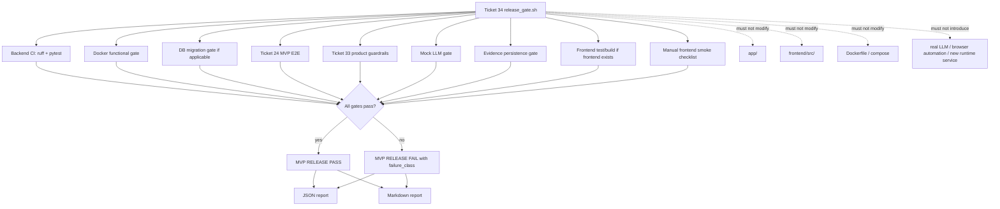

# Ticket 34 — MVP Release Gate

## 0. 목표

Ticket 34의 목표는 **새 기능을 구현하는 것**이 아니라, 지금까지 구현된 MVP가 release 가능한 상태인지 한 번에 판정하는 **최종 release gate**를 만드는 것이다.

이 티켓은 다음만 한다.

```text
existing backend/frontend/test artifacts
  -> release_gate.sh
  -> release report JSON/MD
  -> release smoke helper
  -> manual frontend smoke checklist
  -> pass/fail classification
```

이 티켓은 다음을 하지 않는다.

```text
new backend API
new frontend screen
new DB migration
new Docker/compose topology
new runtime service
new auth system
new LLM provider
browser automation
production mobile polish
push notification
timelapse
marketplace
Polaris / NCCL / P3 long report
```

---

## 1. Ticket Identity

```text
Ticket ID: Ticket 34
Name: MVP Release Gate
Layer: Final MVP Release Verification / Gate Aggregator
```

### Depends on

```text
Ticket 0: Backend Skeleton + CI/CD Baseline
Ticket 1: Core Domain Models + Postgres Baseline
Ticket 2: Plant Onboarding API
Ticket 5/6: Sensor Reading Ingestion API/MQTT if enabled
Ticket 7: Environment Snapshot Aggregation
Ticket 8: Rule Engine Baseline
Ticket 9: Home Plant Card API
Ticket 10: Plant Environment Detail API
Ticket 11: Care Action Logging
Ticket 12: Growth History API
Ticket 18: Chat Care Answer API
Ticket 21: Companion Plant Recommendation API
Ticket 22: Evidence Persistence + Audit Query API
Ticket 23: End-to-End MVP Demo Seed
Ticket 24: MVP E2E Test Harness
Ticket 25: Auth/User Scope Minimal
Ticket 26: API Response Schemas + Frontend Contract
Ticket 27-32: Frontend MVP flows
Ticket 33: MVP Product Guardrail Tests
```

### Does not depend on

```text
production OAuth
production mobile app polish
push notification
timelapse
real external LLM
real marketplace
Polaris / NCCL / P3 long report
```

---

## 2. Core Scope

Ticket 34 owns only:

```text
release-gate scripts
release-gate smoke helper
release report schema
release pytest tests
manual frontend smoke checklist
aggregate pass/fail decision
failure classification matrix
```

Ticket 34 does **not** own:

```text
new product behavior
new endpoint
new frontend route/screen
new DB table
new migration
new Docker service
new compose topology
new runtime worker
new LLM provider
new browser E2E tool
```

---

## 3. Allowed Files

Antigravity may create or modify only:

```text
scripts/release_gate.sh
scripts/release_gate_report.py
scripts/release_gate_smoke.py
tests/release/test_release_gate_manifest.py
tests/release/test_release_gate_report.py
tests/release/test_release_gate_smoke_contract.py
tests/fixtures/release_gate_fixtures.py
docs/mvp_release_gate.md
docs/frontend_manual_smoke_checklist.md
```

Optional:

```text
tests/release/__init__.py
scripts/__init__.py
```

Allowed narrow modifications:

```text
pyproject.toml
package.json
frontend/package.json
.github/workflows/ci.yml
```

Only for:

```text
add pytest marker: release
add script alias: release:gate
add script alias for frontend smoke if project already uses npm
add CI job that runs scripts/release_gate.sh
```

Do **not** remove or weaken existing CI jobs.

---

## 4. Forbidden Files

Do not create or modify:

```text
app/
frontend/src/
alembic/
migrations/
Dockerfile
docker-compose.yml
.env.example
mobile/
ios/
android/
playwright.config.*
cypress.config.*
selenium.*
```

Reason:

```text
Ticket 34 is a release gate aggregator.
It must not change backend product code, frontend product code, DB schema, Docker topology, mobile code, or browser automation tooling.
```

---

## 5. Required Release Gate Components

The release gate must aggregate:

```text
G1. backend quality and tests
G2. Docker functional gate
G3. DB migration gate if migrations/DB stack exists
G4. Ticket 24 MVP E2E demo harness
G5. Mock LLM gate
G6. Ticket 22 evidence persistence gate
G7. Ticket 33 product guardrail tests
G8. frontend typecheck/test/build if frontend/ exists
G9. frontend manual smoke checklist
G10. final JSON + Markdown release report
```

The release gate must be **release-blocking**, not advisory.

---

## 6. MVP Release Pass Criteria

Release may pass only if all are covered and pass:

```text
plant onboarding works
plant card works
sensor status update works
watering log works
care question answer works
evidence persistence works
companion recommendation works
growth history works
forbidden diagnosis behavior is absent
```

---

## 7. Release Script Contract

Create:

```text
scripts/release_gate.sh
```

Required behavior:

```text
fail fast by default
support local/ci mode
run backend quality checks
run backend tests
run guardrail tests
run release tests
run Docker health gate
run DB migration gate if DB stack exists
run E2E MVP harness
run frontend tests/build if frontend exists
write machine-readable JSON report
write human-readable Markdown report
print final pass/fail verdict
return nonzero on any required gate failure
```

Suggested CLI:

```bash
scripts/release_gate.sh --mode local
scripts/release_gate.sh --mode ci
scripts/release_gate.sh --skip-frontend-manual
```

Required report paths:

```text
/tmp/sunshine_release_gate_report.json
/tmp/sunshine_release_gate_report.md
```

---

## 8. Release Report Contract

Create:

```text
scripts/release_gate_report.py
```

Required JSON shape:

```json
{
  "ticket": "Ticket 34",
  "result": "pass",
  "mode": "local",
  "commit": "optional-git-sha",
  "commands_run": [
    {
      "name": "ruff check",
      "command": "ruff check .",
      "result": "pass",
      "failure_class": null
    }
  ],
  "required_flows": {
    "plant_onboarding": "pass",
    "plant_card": "pass",
    "sensor_status_update": "pass",
    "watering_log": "pass",
    "care_question_answer": "pass",
    "evidence_persistence": "pass",
    "companion_recommendation": "pass",
    "growth_history": "pass",
    "forbidden_diagnosis_absent": "pass"
  },
  "invariants": {
    "healthz_liveness_only": "pass",
    "readyz_not_modified_by_ticket34": "pass",
    "mock_llm_only_for_release_gate": "pass",
    "no_external_llm_required": "pass",
    "no_new_runtime_service": "pass",
    "no_backend_product_code_changed": "pass",
    "no_frontend_product_code_changed": "pass"
  },
  "artifacts": {
    "json_report": "/tmp/sunshine_release_gate_report.json",
    "markdown_report": "/tmp/sunshine_release_gate_report.md"
  },
  "violations": []
}
```

Hard rule:

```text
A release gate without reportable JSON + Markdown evidence is a failed release gate.
```

---

## 9. Backend Gate Contract

Release gate must run at least:

```bash
ruff check .
ruff format --check .
pytest -q
pytest -q tests/guardrails
pytest -q tests/e2e
pytest -q tests/release
```

If pytest markers exist, it may run:

```bash
pytest -q -m "not e2e and not guardrail and not release"
pytest -q -m e2e
pytest -q -m guardrail
pytest -q -m release
```

Required invariant:

```text
Do not silently skip E2E or guardrail tests.
```

---

## 10. Docker Gate Contract

Release gate must verify:

```text
docker build succeeds
backend container starts
app.main imports
backend binds 0.0.0.0:8000
GET /healthz returns 200
/healthz JSON exactly equals {"status":"ok","service":"sunshine-backend"}
container stops cleanly
```

Ticket 34 must not modify Dockerfile or docker-compose.

---

## 11. DB Migration Gate Contract

If migrations/DB stack exists, run the project-equivalent of:

```bash
alembic upgrade head
alembic downgrade -1
alembic upgrade head
```

Required:

```text
migrations apply from clean DB
latest downgrade works if project policy supports downgrade
schema drift check passes if existing project has one
demo seed can apply after migrations
```

Forbidden:

```text
creating new migrations in Ticket 34
editing existing migrations
running migrations at backend container startup
```

---

## 12. E2E / Mock LLM / Evidence / Guardrail Gates

Ticket 34 must consume earlier gates, not reimplement product logic.

Required:

```text
run Ticket 24 E2E MVP harness
run Ticket 33 guardrail suite
verify mock LLM mode is used
verify no external LLM env var is required
verify chat answer returns request_id
verify evidence can be fetched by request_id
verify evidence includes prompt_hash and prompt/response linkage
verify care evidence includes rule result
verify retrieved_chunks exists or explicit empty list exists
```

Forbidden:

```text
OPENAI_API_KEY required
ANTHROPIC_API_KEY required
VLLM endpoint required
skipping chat gates when external LLM env is missing
```

---

## 13. Frontend Gate Contract

If `frontend/` exists, run:

```bash
cd frontend
npm ci
npm run typecheck
npm test -- --run
npm run build
```

Required:

```text
frontend builds
frontend tests pass
API client sends X-User-Id
required MVP screens exist
no forbidden diagnosis UI appears
no marketplace/purchase UI appears
```

Ticket 34 must not modify `frontend/src/`.

---

## 14. Manual Frontend Smoke Checklist

Create:

```text
docs/frontend_manual_smoke_checklist.md
```

Must include:

```text
Start backend locally
Start frontend locally
Confirm backend connectivity indicator
Complete Add Plant flow
Select species candidate
Enter nickname and room
View Home plant card
View Environment Detail
Save watering log
Ask “물 줘야 해?”
Ask pest-reference question
Confirm answer is reference-only
Ask “같이 키우기 좋은 식물 추천해줘”
View Growth History
Confirm no image-based disease diagnosis UI exists
Confirm no purchase/marketplace UI exists
```

Browser automation remains forbidden.

---

## 15. Functional Gate Script

Antigravity should make this ticket pass with a script shaped like:

```bash
#!/usr/bin/env bash
set -euo pipefail

MODE="local"
SKIP_FRONTEND_MANUAL="false"

while [[ $# -gt 0 ]]; do
  case "$1" in
    --mode)
      MODE="$2"
      shift 2
      ;;
    --skip-frontend-manual)
      SKIP_FRONTEND_MANUAL="true"
      shift 1
      ;;
    *)
      echo "unknown argument: $1"
      exit 2
      ;;
  esac
done

REPORT_JSON="/tmp/sunshine_release_gate_report.json"
REPORT_MD="/tmp/sunshine_release_gate_report.md"

ruff check .
ruff format --check .
pytest -q

if [ -d tests/guardrails ]; then
  SUNSHINE_USE_MOCK_LLM=true pytest -q tests/guardrails
fi

if [ -d tests/e2e ]; then
  SUNSHINE_USE_MOCK_LLM=true pytest -q tests/e2e
fi

pytest -q tests/release

docker build -t sunshine-backend:release-gate .
docker rm -f sunshine-backend-release-gate >/dev/null 2>&1 || true
docker run -d \
  --name sunshine-backend-release-gate \
  -p 8000:8000 \
  -e APP_NAME=sunshine-backend \
  -e APP_ENV=local \
  -e SUNSHINE_USE_MOCK_LLM=true \
  sunshine-backend:release-gate

cleanup() {
  docker rm -f sunshine-backend-release-gate >/dev/null 2>&1 || true
}
trap cleanup EXIT

for i in $(seq 1 30); do
  if curl -fsS http://localhost:8000/healthz >/tmp/release_healthz.json; then
    break
  fi
  sleep 1
done

python - <<'PY'
import json
from pathlib import Path
body = json.loads(Path('/tmp/release_healthz.json').read_text())
assert body == {"status": "ok", "service": "sunshine-backend"}, body
PY

if [ -d frontend ]; then
  cd frontend
  npm ci
  npm run typecheck
  npm test -- --run
  npm run build
  cd ..
fi

python scripts/release_gate_report.py \
  --ticket "Ticket 34" \
  --result pass \
  --mode "$MODE" \
  --json-out "$REPORT_JSON" \
  --md-out "$REPORT_MD"

test -s "$REPORT_JSON"
test -s "$REPORT_MD"

echo "MVP RELEASE GATE: PASS"
```

This script shape is intentionally conservative. If the actual repository already has equivalent commands, use those, but preserve the same release-blocking categories.

---

## 16. Required Tests

Add at least:

```text
test_release_gate_manifest_lists_all_required_gates
test_release_gate_report_schema_contains_required_flows
test_release_gate_report_schema_contains_required_invariants
test_release_gate_report_records_commands_run
test_release_gate_report_records_failure_classification
test_release_gate_script_mentions_backend_ci
test_release_gate_script_mentions_docker_functional_gate
test_release_gate_script_mentions_migration_gate
test_release_gate_script_mentions_e2e_gate
test_release_gate_script_mentions_guardrail_gate
test_release_gate_script_mentions_frontend_gate
test_release_gate_does_not_require_external_llm
test_release_gate_does_not_use_browser_automation
test_release_gate_does_not_modify_healthz_or_readyz
test_manual_smoke_checklist_contains_all_p0_flows
test_manual_smoke_checklist_contains_forbidden_diagnosis_check
test_manual_smoke_checklist_contains_no_marketplace_check
test_release_gate_failure_classifies_missing_evidence
test_release_gate_failure_classifies_guardrail_failure
test_release_gate_failure_classifies_healthz_regression
```

---

## 17. Failure Classification

```text
python_quality_failure
backend_test_failure
docker_build_failure
container_start_failure
healthz_regression_failure
db_migration_failure
mvp_e2e_failure
mock_llm_failure
evidence_persistence_failure
product_guardrail_failure
frontend_gate_failure
forbidden_diagnosis_behavior
release_report_missing
release_script_contract_failure
readiness_or_runtime_boundary_failure
ticket34_scope_boundary_failure
```

---

## 18. Acceptance Criteria

Ticket 34 passes only if all are true:

```text
release_gate.sh exists
release_gate_report.py exists
release report JSON schema exists
release report Markdown summary exists
backend CI gate is included
Docker functional gate is included
DB migration gate is included or explicitly marked not applicable with reason
E2E MVP demo gate is included
mock LLM gate is included
evidence persistence gate is included
product guardrail gate is included
frontend build/test gate is included if frontend exists
frontend manual smoke checklist exists
plant onboarding is covered
plant card is covered
sensor status update is covered
watering log is covered
care question answer is covered
evidence persistence is covered
companion recommendation is covered
growth history is covered
forbidden diagnosis absence is covered
release gate uses mock LLM only
no external LLM is required
no browser automation is introduced
no backend product code is modified
no frontend src product code is modified
no DB migration is modified
no Docker/compose topology is modified
/healthz remains liveness-only
/readyz is not introduced or modified by this ticket
release report contains commands_run
release report contains failure classifications
release gate returns nonzero on any required gate failure
```

---

## 19. Mermaid Flow



---

## 20. Boundary Audit

```text
Scope preserved: yes
Release gate aggregator only: yes
New backend API implemented: no
New frontend screen implemented: no
DB migration introduced: no
Docker/compose topology modified: no
Browser automation introduced: no
Real external LLM required: no
Product behavior modified: no
Release report required: yes
Guardrails release-blocking: yes
Evidence persistence release-blocking: yes
/healthz modified: no
/readyz introduced: no
Ticket 34 independently verifiable: yes
```
